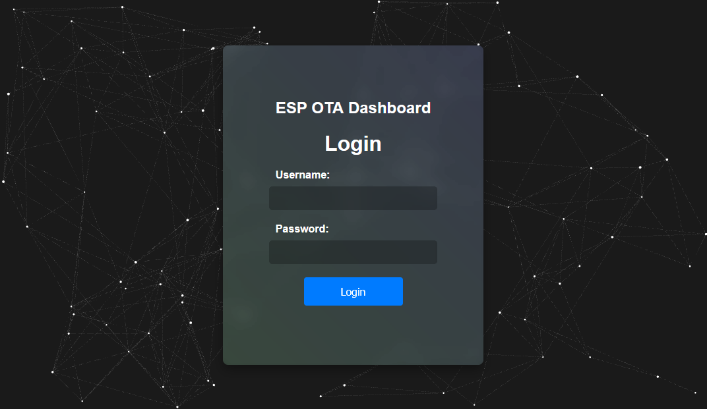
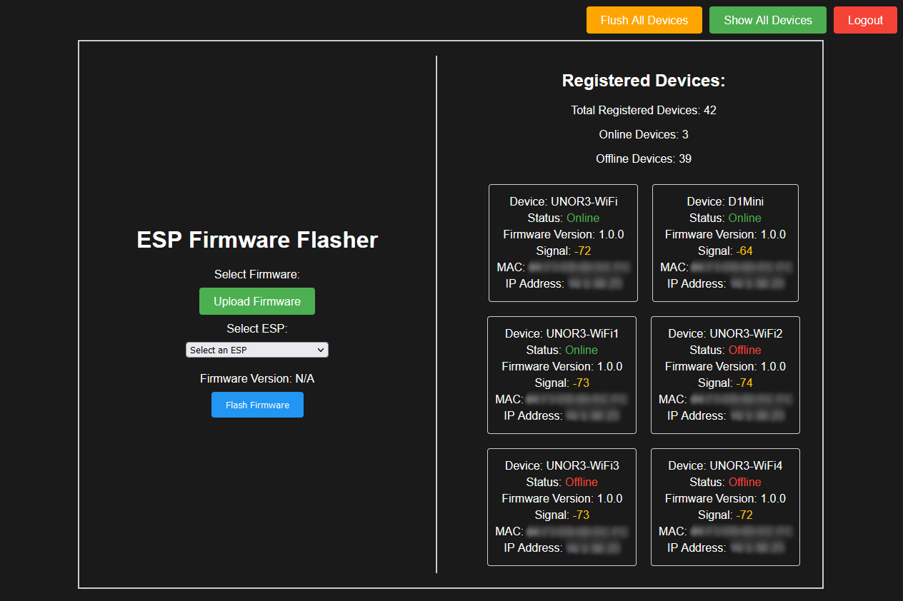
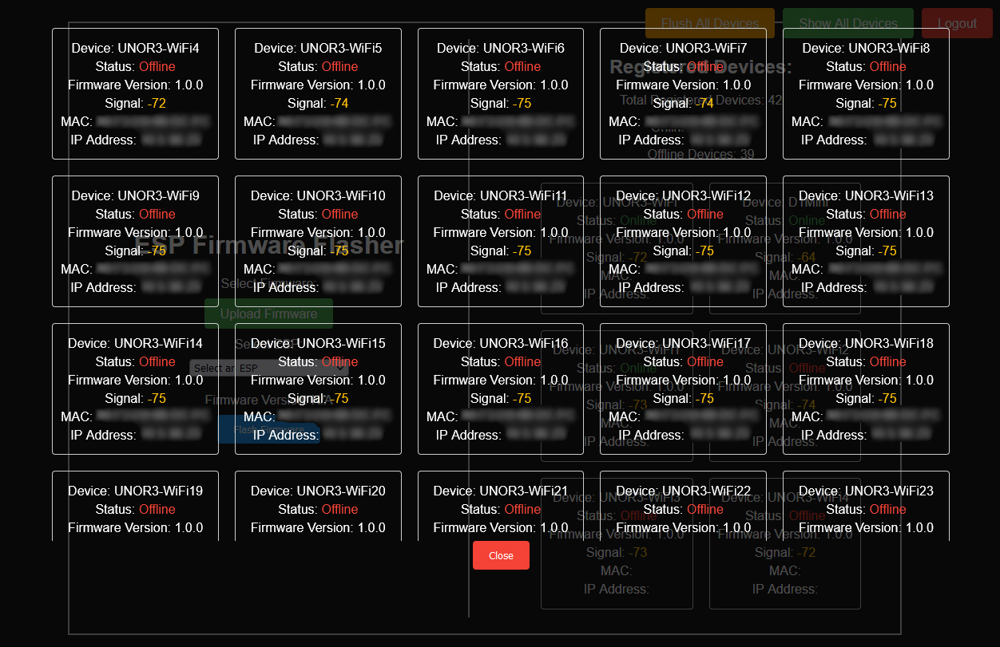

# ESP OTA Dashboard
an efficient and user friendly OTA server equipped with a powerful WEB UI, designed to effortlessly manage both your ESP8266 and ESP32 Firmware and Status. This OTA solution simplifies the process of updating and monitoring your ESP devices.

## Features
- Lightweight Node.js server
- Support both ESP8266 and ESP32
- User friendly WEB UI to manage Firmware updates remotely
- Secure frontend login page by username and password
- Secured Flash Firmware by password in WEB UI
- Register devices to server by devices hostname
- Display the registered devices information in WEB UI: MAC address, IP address, Signal strength, Firmware version, and hostname
- Display the number of Registered, Online and Offline devices in WEB UI
- Monitor the Online/Offline status of devices in WEB UI
- Option to Flush all registered devcies
- Load registered devices at server startup
- Custom library for Arduino to support ESP8266 and ESP32 [ESPOTADASH](https://github.com/ErfanDL/ESPOTADASH_Library)

## Devices list
By default, 6 registered devices are displayed. If you have more than 6 devices, click on the 'Show All Devices' button to see the list of all devices.

## Screenshots
- Login page

- OTA and Devices

- Show All Devices

## Server installation
Prerequisites

1. Before proceeding, make sure you have the following prerequisites: Node.js and npm installed on your system.

2. Clone the GitHub repository using the following command:

`git clone https://github.com/ErfanDL/ESP_OTA_Dashboard.git`

3. Navigate into the project directory using the following command:

`cd ESP_OTA_Dashboard`
